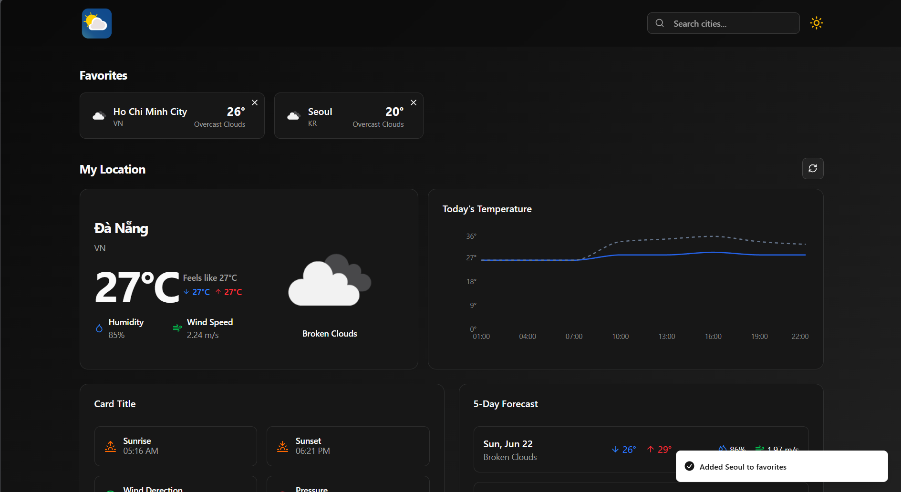

# WeatherApp 🌦️

A simple and elegant weather forecasting application built with TypeScript and React. This app allows users to get real-time weather data for any city in the world.

[](https://opensource.org/licenses/MIT)

## 📍 Live Demo

A live version of the application is available here:

➡️ **[View Live Demo](https://weatherappnermadie.web.app/ )**

## 📸 Screenshot

Here's a sneak peek of what the application looks like.




## ✨ Features

- **Real-time Weather Data:** Instantly access current temperature, humidity, wind speed, and weather conditions.
- **Global City Search:** Find weather information for any city around the globe.
- **Responsive Design:** A fully responsive layout that works seamlessly on desktop, tablet, and mobile devices.
- **Clean User Interface:** A modern and intuitive UI for an excellent user experience.

## 🛠️ Tech Stack

This project is built using a modern set of web technologies:

- **Language:** TypeScript
- **Framework:** React.js
- **Styling:** Tailwind CSS (or specify CSS Modules, Styled-Components, etc.)
- **API Client:** Axios for making HTTP requests to the weather API.
- **Build Tool:** Vite for a fast development experience.
- **Icons:** React Icons

## 🚀 Getting Started

Follow these instructions to set up and run the project on your local machine.

### Prerequisites

Make sure you have [Node.js](https://nodejs.org/) (version 18 or later) and a package manager like [npm](https://www.npmjs.com/) or [yarn](https://yarnpkg.com/) installed.

### Installation

1.  **Clone the repository** Clone the project to your local machine.
    ```bash
    git clone [https://github.com/nermadie/WeatherApp.git](https://github.com/nermadie/WeatherApp.git)
    ```

2.  **Navigate to the project directory**
    ```bash
    cd WeatherApp
    ```

3.  **Install dependencies** Install all the required packages.
    ```bash
    npm install
    # or
    yarn install
    ```

4.  **Set up environment variables** This project requires an API key from a weather service provider like [OpenWeatherMap](https://openweathermap.org/api) or [WeatherAPI](https://www.weatherapi.com/).

    - Create a file named `.env` in the root of the project.
    - Add your API key to the file as shown below:

    ```env
    VITE_WEATHER_API_KEY="your_api_key_goes_here"
    ```

5.  **Run the application** Start the development server.
    ```bash
    npm run dev
    # or
    yarn dev
    ```
    The application will be available at `http://localhost:5173` (or another port specified by Vite).

## 🤝 Contributing

Contributions are what make the open-source community such an amazing place to learn, inspire, and create. Any contributions you make are **greatly appreciated**.

If you have a suggestion that would make this better, please fork the repo and create a pull request. You can also simply open an issue with the tag "enhancement".

1.  **Fork** the Project
2.  Create your Feature Branch (`git checkout -b feature/AmazingFeature`)
3.  Commit your Changes (`git commit -m 'Add some AmazingFeature'`)
4.  Push to the Branch (`git push origin feature/AmazingFeature`)
5.  Open a **Pull Request**

## 📄 License

This project is distributed under the MIT License. See the `LICENSE` file for more information.
